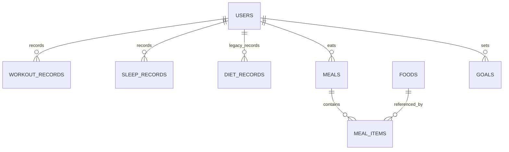

# Fitters MVP 数据库契约

本文档是 Fitters MVP 阶段的数据库设计说明，用于统一后端、数据库和后续接口开发时对表结构的理解。

## 技术基线

- 运行环境：Node.js 20 LTS
- API：TypeScript + Express
- 数据库：PostgreSQL 14+
- ORM 与迁移：Prisma + Prisma Migrate
- 接口统一响应格式：`{ code, message, data }`

## 设计范围

当前数据库 MVP 保留已有的用户、运动记录和目标表，并补充睡眠和饮食数据的持久化结构。

本次变更只涉及数据库层，不新增或修改前端页面、后端路由、控制器和统计接口。需要后续接口配合的内容统一写在本文档的 TODO 小节中。

建模原则是：核心查询字段使用关系型表和普通列保存，扩展信息才使用 JSONB 字段。

## 数据表

### users

用户账号表，保存登录账号、密码哈希和展示昵称。

| 字段 | 类型 | 必填 | 规则 |
| --- | --- | --- | --- |
| id | serial integer | 是 | 主键 |
| account | varchar(64) | 是 | 登录账号，唯一 |
| password_hash | varchar(255) | 是 | 只保存 bcrypt 哈希，禁止保存明文密码 |
| nickname | varchar(64) | 否 | 展示昵称 |
| created_at | timestamp | 是 | 数据库生成创建时间 |
| updated_at | timestamp | 是 | Prisma 自动更新时间 |

### workout_records

运动记录表，保存用户每次运动的类型、时长、热量和日期。

| 字段 | 类型 | 必填 | 规则 |
| --- | --- | --- | --- |
| id | serial integer | 是 | 主键 |
| user_id | integer | 是 | 外键关联 `users.id`，用户删除时级联删除 |
| type | varchar(64) | 是 | 运动类型 |
| duration_min | integer | 是 | 运动分钟数，必须为正数 |
| calories | integer | 是 | 消耗热量，不能为负数 |
| record_date | date | 是 | 运动日期 |
| notes | varchar(255) | 否 | 备注 |
| created_at | timestamp | 是 | 数据库生成创建时间 |

索引：`idx_workout_records_user_record_date`，字段为 `(user_id, record_date)`。

### sleep_records

睡眠记录表，保存每日睡眠日期、总睡眠时长、深睡时长、入睡时间、醒来时间和睡眠质量。

| 字段 | 类型 | 必填 | 规则 |
| --- | --- | --- | --- |
| id | serial integer | 是 | 主键 |
| user_id | integer | 是 | 外键关联 `users.id`，用户删除时级联删除 |
| record_date | date | 是 | 睡眠记录日期，默认当前日期 |
| duration_hours | decimal(4,2) | 否 | 总睡眠小时数；填写时必须大于 0 |
| deep_hours | decimal(4,2) | 否 | 深睡小时数；填写时不能为负，且不能大于总睡眠时长 |
| bed_time | timestamp | 是 | 入睡时间；在 Prisma 中映射为 `sleepTime`，兼容当前路由 |
| wake_time | timestamp | 是 | 醒来时间 |
| quality_score | integer | 是 | 睡眠质量分，范围 0 到 100；在 Prisma 中映射为 `quality` |
| notes | varchar(255) | 否 | 备注 |
| metadata | jsonb | 否 | 扩展信息，例如设备来源、睡眠阶段明细等 |
| created_at | timestamp | 是 | 数据库生成创建时间 |

索引：`idx_sleep_records_user_record_date`，字段为 `(user_id, record_date)`。

### diet_records

饮食汇总记录表，保留用于兼容当前 `main` 分支中已经存在的 `/api/diets` 路由。结构化饮食 MVP 的主表是 `foods`、`meals` 和 `meal_items`。

| 字段 | 类型 | 必填 | 规则 |
| --- | --- | --- | --- |
| id | serial integer | 是 | 主键 |
| user_id | integer | 是 | 外键关联 `users.id`，用户删除时级联删除 |
| type | varchar(64) | 是 | 简单饮食类型或标签 |
| calories | integer | 是 | 摄入热量，不能为负数 |
| record_date | date | 是 | 饮食记录日期 |
| notes | varchar(255) | 否 | 备注 |
| created_at | timestamp | 是 | 数据库生成创建时间 |

索引：`idx_diet_records_user_record_date`，字段为 `(user_id, record_date)`。

### foods

食物库表，保存常用食物的基础营养信息，供餐次明细引用。

| 字段 | 类型 | 必填 | 规则 |
| --- | --- | --- | --- |
| id | serial integer | 是 | 主键 |
| name | varchar(128) | 是 | 食物名称，唯一 |
| calories_kcal | integer | 是 | 参考热量，不能为负数 |
| protein_grams | decimal(6,2) | 否 | 蛋白质克数；填写时不能为负数 |
| fat_grams | decimal(6,2) | 否 | 脂肪克数；填写时不能为负数 |
| carb_grams | decimal(6,2) | 否 | 碳水克数；填写时不能为负数 |
| serving_grams | decimal(6,2) | 否 | 参考份量克数；填写时必须大于 0 |
| metadata | jsonb | 否 | 扩展食物信息 |
| created_at | timestamp | 是 | 数据库生成创建时间 |

唯一索引：`foods_name_key`，字段为 `name`。

### meals

餐次表，保存用户某一天的一餐，例如早餐、午餐、晚餐或加餐。

| 字段 | 类型 | 必填 | 规则 |
| --- | --- | --- | --- |
| id | serial integer | 是 | 主键 |
| user_id | integer | 是 | 外键关联 `users.id`，用户删除时级联删除 |
| meal_date | date | 是 | 餐次日期 |
| meal_type | varchar(32) | 是 | 餐次类型，例如 breakfast、lunch、dinner、snack |
| notes | varchar(255) | 否 | 备注 |
| created_at | timestamp | 是 | 数据库生成创建时间 |

索引：`idx_meals_user_meal_date`，字段为 `(user_id, meal_date)`。

### meal_items

餐次明细表，保存一餐中具体吃了哪些食物和对应营养数据。

| 字段 | 类型 | 必填 | 规则 |
| --- | --- | --- | --- |
| id | serial integer | 是 | 主键 |
| meal_id | integer | 是 | 外键关联 `meals.id`，餐次删除时级联删除 |
| food_id | integer | 否 | 可选外键关联 `foods.id`；食物删除时设为空 |
| food_name | varchar(128) | 是 | 冗余保存食物名称，便于历史展示 |
| quantity_grams | decimal(8,2) | 否 | 摄入克数；填写时必须大于 0 |
| calories | integer | 是 | 摄入热量，不能为负数 |
| protein_grams | decimal(6,2) | 否 | 蛋白质克数；填写时不能为负数 |
| fat_grams | decimal(6,2) | 否 | 脂肪克数；填写时不能为负数 |
| carb_grams | decimal(6,2) | 否 | 碳水克数；填写时不能为负数 |
| metadata | jsonb | 否 | 扩展明细信息 |
| created_at | timestamp | 是 | 数据库生成创建时间 |

索引：

- `idx_meal_items_meal_id`，字段为 `(meal_id)`
- `idx_meal_items_food_id`，字段为 `(food_id)`

### goals

健康目标表，保存用户每日运动、睡眠和饮食目标。

| 字段 | 类型 | 必填 | 规则 |
| --- | --- | --- | --- |
| id | serial integer | 是 | 主键 |
| user_id | integer | 是 | 外键关联 `users.id`，用户删除时级联删除 |
| goal_type | enum | 是 | `DAILY_WORKOUT_MINUTES`、`DAILY_SLEEP_HOURS`、`DAILY_DIET_CALORIES` |
| target_value | integer | 是 | 目标值，必须为正数 |
| period | enum | 是 | MVP 阶段使用 `DAILY` |
| created_at | timestamp | 是 | 数据库生成创建时间 |
| updated_at | timestamp | 是 | Prisma 自动更新时间 |

唯一约束：`(user_id, goal_type, period)`，保证同一用户同一周期同一目标类型只有一条当前目标。

## ER 关系

## 当前接口覆盖

当前受保护接口都从 JWT 中解析 `user_id`，不从请求体接收数据归属。

- `POST /api/auth/register`
- `POST /api/auth/login`
- `POST /api/workouts`
- `GET /api/workouts`
- `DELETE /api/workouts/:id`
- `POST /api/goals`
- `GET /api/stats/today`
- `GET /api/stats/weekly`
- `GET /api/stats/summary`

## 后续接口 TODO

- 对齐 `/api/sleeps`，使其写入 `record_date`、`duration_hours`、`deep_hours`、`bed_time`、`wake_time`、`quality_score`、`notes` 和 `metadata`。
- 对齐 `/api/diets`，后续应写入结构化的 `meals` 和 `meal_items`；`diet_records` 只作为兼容或汇总表保留。
- 更新 `/api/stats/today`，按运动、睡眠、饮食三类每日目标聚合统计数据。
- 健康报告、智能建议、提醒、设备原始数据和审计日志表留到下一阶段，本次 MVP 数据库变更不包含这些表。
