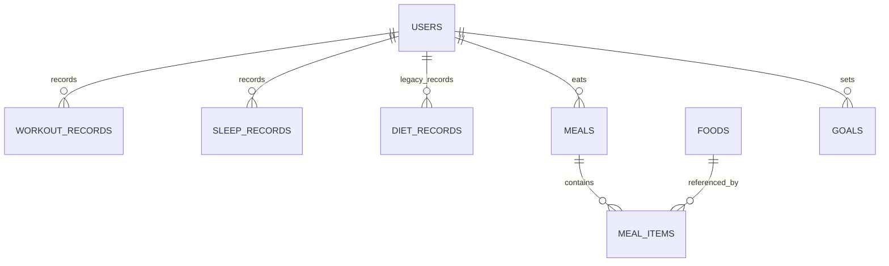

# Fitters MVP Database Contract

This document is the shared database reference for the MVP database layer.

## Technology Baseline

- Runtime: Node.js 20 LTS
- API: TypeScript + Express
- Database: PostgreSQL 14+
- ORM and migrations: Prisma + Prisma Migrate
- Core response shape: `{ code, message, data }`

## Design Scope

The current database MVP keeps the existing user, workout, and goal tables, then adds sleep and diet persistence.

This change is database-only. It does not add or change frontend pages, backend routes, controllers, or stats behavior. API integration tasks are listed in the TODO section.

The modeling rule is: use relational tables for core query fields, and use JSONB only for optional extension data.

## Tables

### users

| Field | Type | Required | Rule |
| --- | --- | --- | --- |
| id | serial integer | yes | Primary key |
| account | varchar(64) | yes | Unique login account |
| password_hash | varchar(255) | yes | bcrypt hash only; never store raw password |
| nickname | varchar(64) | no | Display name |
| created_at | timestamp | yes | Created by database |
| updated_at | timestamp | yes | Updated by Prisma |

### workout_records

| Field | Type | Required | Rule |
| --- | --- | --- | --- |
| id | serial integer | yes | Primary key |
| user_id | integer | yes | Foreign key to `users.id`; cascade delete |
| type | varchar(64) | yes | Workout type |
| duration_min | integer | yes | Positive minutes |
| calories | integer | yes | Non-negative kcal |
| record_date | date | yes | Workout date |
| notes | varchar(255) | no | Optional note |
| created_at | timestamp | yes | Created by database |

Index: `idx_workout_records_user_record_date` on `(user_id, record_date)`.

### sleep_records

| Field | Type | Required | Rule |
| --- | --- | --- | --- |
| id | serial integer | yes | Primary key |
| user_id | integer | yes | Foreign key to `users.id`; cascade delete |
| record_date | date | yes | Sleep record date; defaults to current date |
| duration_hours | decimal(4,2) | no | Positive when present |
| deep_hours | decimal(4,2) | no | Non-negative and not greater than `duration_hours` when both are present |
| bed_time | timestamp | yes | Sleep start time; mapped to Prisma `sleepTime` for current route compatibility |
| wake_time | timestamp | yes | Wake time |
| quality_score | integer | yes | 0 to 100; mapped to Prisma `quality` |
| notes | varchar(255) | no | Optional note |
| metadata | jsonb | no | Optional extension payload |
| created_at | timestamp | yes | Created by database |

Index: `idx_sleep_records_user_record_date` on `(user_id, record_date)`.

### diet_records

`diet_records` is retained as a compatibility table for the existing `/api/diets` route already present on `main`. The structured diet MVP tables are `foods`, `meals`, and `meal_items`.

| Field | Type | Required | Rule |
| --- | --- | --- | --- |
| id | serial integer | yes | Primary key |
| user_id | integer | yes | Foreign key to `users.id`; cascade delete |
| type | varchar(64) | yes | Simple diet type or label |
| calories | integer | yes | Non-negative kcal |
| record_date | date | yes | Diet record date |
| notes | varchar(255) | no | Optional note |
| created_at | timestamp | yes | Created by database |

Index: `idx_diet_records_user_record_date` on `(user_id, record_date)`.

### foods

| Field | Type | Required | Rule |
| --- | --- | --- | --- |
| id | serial integer | yes | Primary key |
| name | varchar(128) | yes | Unique food name |
| calories_kcal | integer | yes | Non-negative kcal per serving reference |
| protein_grams | decimal(6,2) | no | Non-negative when present |
| fat_grams | decimal(6,2) | no | Non-negative when present |
| carb_grams | decimal(6,2) | no | Non-negative when present |
| serving_grams | decimal(6,2) | no | Positive when present |
| metadata | jsonb | no | Optional food extension data |
| created_at | timestamp | yes | Created by database |

Unique key: `foods_name_key` on `name`.

### meals

| Field | Type | Required | Rule |
| --- | --- | --- | --- |
| id | serial integer | yes | Primary key |
| user_id | integer | yes | Foreign key to `users.id`; cascade delete |
| meal_date | date | yes | Meal date |
| meal_type | varchar(32) | yes | Example: breakfast, lunch, dinner, snack |
| notes | varchar(255) | no | Optional note |
| created_at | timestamp | yes | Created by database |

Index: `idx_meals_user_meal_date` on `(user_id, meal_date)`.

### meal_items

| Field | Type | Required | Rule |
| --- | --- | --- | --- |
| id | serial integer | yes | Primary key |
| meal_id | integer | yes | Foreign key to `meals.id`; cascade delete |
| food_id | integer | no | Optional foreign key to `foods.id`; set null on food delete |
| food_name | varchar(128) | yes | Denormalized food name for historical display |
| quantity_grams | decimal(8,2) | no | Positive when present |
| calories | integer | yes | Non-negative kcal |
| protein_grams | decimal(6,2) | no | Non-negative when present |
| fat_grams | decimal(6,2) | no | Non-negative when present |
| carb_grams | decimal(6,2) | no | Non-negative when present |
| metadata | jsonb | no | Optional meal item extension data |
| created_at | timestamp | yes | Created by database |

Indexes:

- `idx_meal_items_meal_id` on `(meal_id)`
- `idx_meal_items_food_id` on `(food_id)`

### goals

| Field | Type | Required | Rule |
| --- | --- | --- | --- |
| id | serial integer | yes | Primary key |
| user_id | integer | yes | Foreign key to `users.id`; cascade delete |
| goal_type | enum | yes | `DAILY_WORKOUT_MINUTES`, `DAILY_SLEEP_HOURS`, `DAILY_DIET_CALORIES` |
| target_value | integer | yes | Positive target value |
| period | enum | yes | MVP uses `DAILY` |
| created_at | timestamp | yes | Created by database |
| updated_at | timestamp | yes | Updated by Prisma |

Unique key: `(user_id, goal_type, period)`.

## ER Relationship

## API Coverage

Current protected APIs derive `user_id` from JWT and never accept user ownership from request bodies.

- `POST /api/auth/register`
- `POST /api/auth/login`
- `POST /api/workouts`
- `GET /api/workouts`
- `DELETE /api/workouts/:id`
- `POST /api/goals`
- `GET /api/stats/today`
- `GET /api/stats/weekly`
- `GET /api/stats/summary`

## TODO For API Integration

- Implement or align `/api/sleeps` to persist `record_date`, `duration_hours`, `deep_hours`, `bed_time`, `wake_time`, `quality_score`, `notes`, and `metadata`.
- Implement or align `/api/diets` to write structured `meals` and `meal_items`, while keeping `diet_records` only as a compatibility summary table if needed.
- Update `/api/stats/today` to aggregate workout minutes, sleep hours, and diet calories against the three daily goal types.
- Add report, suggestion, reminder, device raw data, and audit tables in a later phase. They are intentionally not part of this MVP database change.
