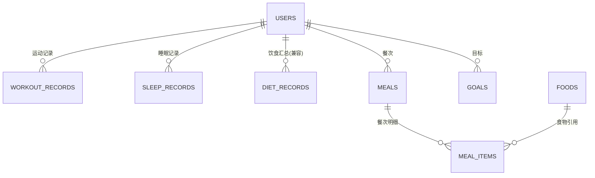

# Fitters 数据库设计文档

> 数据库负责人：袁启泰  
> 最后更新：2026-05-28  
> 分支：`yqt-database-schema`

---

## 一、技术栈

| 项 | 选型 |
|----|------|
| 数据库 | PostgreSQL 16 (Docker: `postgres:16-alpine`) |
| ORM | Prisma 5.22 |
| 迁移工具 | Prisma Migrate |
| 后端 | Node.js 20 + TypeScript + Express |
| 数据库名 | `health_app`，schema `public` |

---

## 二、枚举类型

### GoalType（目标类型）

| 值 | 含义 |
|----|------|
| `DAILY_WORKOUT_MINUTES` | 每日运动目标（分钟） |
| `DAILY_SLEEP_HOURS` | 每日睡眠目标（小时） |
| `DAILY_DIET_CALORIES` | 每日饮食目标（热量） |

### GoalPeriod（目标周期）

| 值 | 含义 |
|----|------|
| `DAILY` | 每日目标 |

---

## 三、数据表（共 8 张）

### 3.1 users — 用户表

| 字段 | 数据库类型 | 必填 | 约束 |
|------|-----------|------|------|
| `id` | SERIAL INTEGER | 是 | PRIMARY KEY |
| `account` | VARCHAR(64) | 是 | NOT NULL, UNIQUE |
| `password_hash` | VARCHAR(255) | 是 | NOT NULL（bcrypt 哈希，禁止明文） |
| `nickname` | VARCHAR(64) | 否 | — |
| `created_at` | TIMESTAMP(3) | 是 | NOT NULL, DEFAULT CURRENT_TIMESTAMP |
| `updated_at` | TIMESTAMP(3) | 是 | NOT NULL, 自动更新 |

**索引：**
- PK: `users_pkey` (`id`)
- UNIQUE: `users_account_key` (`account`)

---

### 3.2 workout_records — 运动记录表

| 字段 | 数据库类型 | 必填 | 约束 |
|------|-----------|------|------|
| `id` | SERIAL INTEGER | 是 | PRIMARY KEY |
| `user_id` | INTEGER | 是 | FK → users(id) ON DELETE CASCADE |
| `type` | VARCHAR(64) | 是 | NOT NULL |
| `duration_min` | INTEGER | 是 | NOT NULL |
| `calories` | INTEGER | 是 | NOT NULL, DEFAULT 0 |
| `record_date` | DATE | 是 | NOT NULL |
| `notes` | VARCHAR(255) | 否 | — |
| `created_at` | TIMESTAMP(3) | 是 | NOT NULL, DEFAULT CURRENT_TIMESTAMP |

**索引：**
- PK: `workout_records_pkey` (`id`)
- COMPOSITE: `idx_workout_records_user_record_date` (`user_id`, `record_date`)

---

### 3.3 sleep_records — 睡眠记录表

| 字段 | 数据库类型 | 必填 | 约束 |
|------|-----------|------|------|
| `id` | SERIAL INTEGER | 是 | PRIMARY KEY |
| `user_id` | INTEGER | 是 | FK → users(id) ON DELETE CASCADE |
| `record_date` | DATE | 是 | NOT NULL, DEFAULT CURRENT_DATE |
| `duration_hours` | DECIMAL(4,2) | 否 | CHECK: IS NULL OR > 0 |
| `deep_hours` | DECIMAL(4,2) | 否 | CHECK: IS NULL OR >= 0; deep_hours ≤ duration_hours |
| `bed_time` | TIMESTAMP(3) | 是 | NOT NULL |
| `wake_time` | TIMESTAMP(3) | 是 | NOT NULL |
| `quality_score` | INTEGER | 是 | NOT NULL, DEFAULT 0, CHECK: 0 ≤ x ≤ 100 |
| `notes` | VARCHAR(255) | 否 | — |
| `metadata` | JSONB | 否 | 扩展字段（设备来源、睡眠阶段等） |
| `created_at` | TIMESTAMP(3) | 是 | NOT NULL, DEFAULT CURRENT_TIMESTAMP |

**索引：**
- PK: `sleep_records_pkey` (`id`)
- COMPOSITE: `idx_sleep_records_user_record_date` (`user_id`, `record_date`)

**检查约束：**
- `duration_hours` 填写时必须 > 0
- `deep_hours` 填写时必须 ≥ 0，且 ≤ duration_hours
- `quality_score` ∈ [0, 100]

---

### 3.4 diet_records — 饮食汇总记录表（兼容保留）

> 说明：此表用于兼容现有 `/api/diets` 路由。结构化饮食数据请使用 `foods` → `meals` → `meal_items` 链路。

| 字段 | 数据库类型 | 必填 | 约束 |
|------|-----------|------|------|
| `id` | SERIAL INTEGER | 是 | PRIMARY KEY |
| `user_id` | INTEGER | 是 | FK → users(id) ON DELETE CASCADE |
| `type` | VARCHAR(64) | 是 | NOT NULL |
| `calories` | INTEGER | 是 | NOT NULL, DEFAULT 0, CHECK ≥ 0 |
| `record_date` | DATE | 是 | NOT NULL |
| `notes` | VARCHAR(255) | 否 | — |
| `created_at` | TIMESTAMP(3) | 是 | NOT NULL, DEFAULT CURRENT_TIMESTAMP |

**索引：**
- PK: `diet_records_pkey` (`id`)
- COMPOSITE: `idx_diet_records_user_record_date` (`user_id`, `record_date`)

---

### 3.5 foods — 食物库表

| 字段 | 数据库类型 | 必填 | 约束 |
|------|-----------|------|------|
| `id` | SERIAL INTEGER | 是 | PRIMARY KEY |
| `name` | VARCHAR(128) | 是 | NOT NULL, UNIQUE |
| `calories_kcal` | INTEGER | 是 | NOT NULL, DEFAULT 0, CHECK ≥ 0 |
| `protein_grams` | DECIMAL(6,2) | 否 | CHECK ≥ 0 |
| `fat_grams` | DECIMAL(6,2) | 否 | CHECK ≥ 0 |
| `carb_grams` | DECIMAL(6,2) | 否 | CHECK ≥ 0 |
| `serving_grams` | DECIMAL(6,2) | 否 | CHECK > 0 |
| `metadata` | JSONB | 否 | 扩展字段（如外部食物库 ID、条形码等） |
| `created_at` | TIMESTAMP(3) | 是 | NOT NULL, DEFAULT CURRENT_TIMESTAMP |

**索引：**
- PK: `foods_pkey` (`id`)
- UNIQUE: `foods_name_key` (`name`)

---

### 3.6 meals — 餐次表

| 字段 | 数据库类型 | 必填 | 约束 |
|------|-----------|------|------|
| `id` | SERIAL INTEGER | 是 | PRIMARY KEY |
| `user_id` | INTEGER | 是 | FK → users(id) ON DELETE CASCADE |
| `meal_date` | DATE | 是 | NOT NULL |
| `meal_type` | VARCHAR(32) | 是 | NOT NULL（如 breakfast/lunch/dinner/snack） |
| `notes` | VARCHAR(255) | 否 | — |
| `created_at` | TIMESTAMP(3) | 是 | NOT NULL, DEFAULT CURRENT_TIMESTAMP |

**索引：**
- PK: `meals_pkey` (`id`)
- COMPOSITE: `idx_meals_user_meal_date` (`user_id`, `meal_date`)

---

### 3.7 meal_items — 餐次明细表

| 字段 | 数据库类型 | 必填 | 约束 |
|------|-----------|------|------|
| `id` | SERIAL INTEGER | 是 | PRIMARY KEY |
| `meal_id` | INTEGER | 是 | FK → meals(id) ON DELETE CASCADE |
| `food_id` | INTEGER | 否 | FK → foods(id) ON DELETE SET NULL |
| `food_name` | VARCHAR(128) | 是 | NOT NULL（冗余保存，便于历史追溯） |
| `quantity_grams` | DECIMAL(8,2) | 否 | CHECK > 0 |
| `calories` | INTEGER | 是 | NOT NULL, DEFAULT 0, CHECK ≥ 0 |
| `protein_grams` | DECIMAL(6,2) | 否 | CHECK ≥ 0 |
| `fat_grams` | DECIMAL(6,2) | 否 | CHECK ≥ 0 |
| `carb_grams` | DECIMAL(6,2) | 否 | CHECK ≥ 0 |
| `metadata` | JSONB | 否 | 扩展字段 |
| `created_at` | TIMESTAMP(3) | 是 | NOT NULL, DEFAULT CURRENT_TIMESTAMP |

**索引：**
- PK: `meal_items_pkey` (`id`)
- `idx_meal_items_meal_id` (`meal_id`)
- `idx_meal_items_food_id` (`food_id`)

---

### 3.8 goals — 健康目标表

| 字段 | 数据库类型 | 必填 | 约束 |
|------|-----------|------|------|
| `id` | SERIAL INTEGER | 是 | PRIMARY KEY |
| `user_id` | INTEGER | 是 | FK → users(id) ON DELETE CASCADE |
| `goal_type` | ENUM (GoalType) | 是 | NOT NULL |
| `target_value` | INTEGER | 是 | NOT NULL |
| `period` | ENUM (GoalPeriod) | 是 | NOT NULL, DEFAULT DAILY |
| `created_at` | TIMESTAMP(3) | 是 | NOT NULL, DEFAULT CURRENT_TIMESTAMP |
| `updated_at` | TIMESTAMP(3) | 是 | NOT NULL, 自动更新 |

**索引：**
- PK: `goals_pkey` (`id`)
- UNIQUE COMPOSITE: `uq_goals_user_type_period` (`user_id`, `goal_type`, `period`)

---

## 四、ER 关系图

```
┌──────────┐
│  users   │
└────┬─────┘
     │ 1
     │
     ├──< workout_records    (user_id → users.id, CASCADE)
     ├──< sleep_records      (user_id → users.id, CASCADE)
     ├──< diet_records       (user_id → users.id, CASCADE)
     ├──< meals              (user_id → users.id, CASCADE)
     └──< goals              (user_id → users.id, CASCADE)

┌──────────┐     ┌────────────┐
│  meals   │────<│ meal_items │
└──────────┘  1  └─────┬──────┘
                      * │
                        │  0..1
                 ┌──────┴──────┐
                 │    foods    │
                 └─────────────┘

meal_items.meal_id  → meals.id  (CASCADE)
meal_items.food_id  → foods.id  (SET NULL)
```

**Mermaid 版本（可渲染）：**



---

## 五、已有接口覆盖

| 方法 | 路径 | 说明 |
|------|------|------|
| POST | `/api/auth/register` | 注册 |
| POST | `/api/auth/login` | 登录 |
| POST | `/api/workouts` | 添加运动记录 |
| GET | `/api/workouts` | 查询运动记录 |
| DELETE | `/api/workouts/:id` | 删除运动记录 |
| POST | `/api/goals` | 设置目标 |
| GET | `/api/stats/today` | 今日统计 |
| GET | `/api/stats/weekly` | 周统计 |
| GET | `/api/stats/summary` | 汇总统计 |

---

## 六、待办事项

- [ ] 对齐 `/api/sleeps` 接口，写入睡眠结构化字段
- [ ] 对齐 `/api/diets`，接入 `meals` + `meal_items` 结构化链路
- [ ] 更新统计接口，按运动/睡眠/饮食三类聚合
- [ ] 外部工具接入：考虑增加 `device_data_sources` 表追踪数据来源
- [ ] 外部工具接入：`foods` 表补充 `barcode`(条形码) 字段支持扫码录入
- [ ] 后续阶段：健康报告、智能建议、提醒、审计日志表
